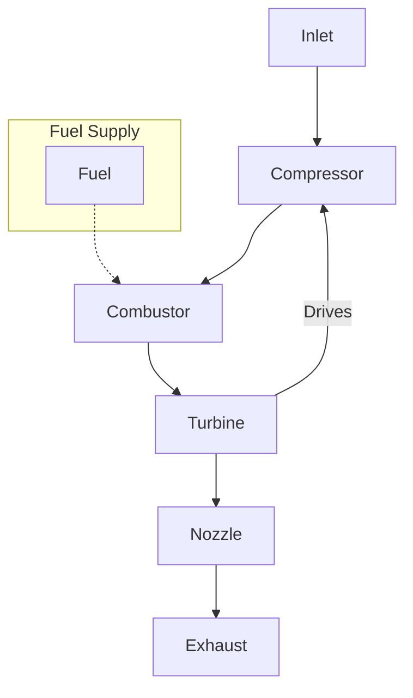

# EAS4300 – HW7 Q1: Turbojet Performance Analysis

This repository contains code and outputs for analyzing a **non-afterburning turbojet** operating at 15 km altitude and Mach $M = 1.8$. The MATLAB script computes key performance parameters such as:

- **Specific Thrust** $I$  
- **Thrust-Specific Fuel Consumption (TSFC)**  
- **Thermal**, **Propulsive**, and **Overall** Efficiencies: $\eta_{th}$, $\eta_{p}$, and $\eta_{0}$  
- **Nozzle Area Ratio**  

and plots them against the **compressor pressure ratio** $r_c$.

---

## Files

1. [**HW7_Q1.m**](HW7_Q1.m)  
   Main MATLAB script that:
   - Calculates the performance parameters for a range of compressor pressure ratios $r_c$.
   - Saves the computed results in a CSV file.
   - Produces four separate figures, each appended to **HW7_Q1_Plots.pdf**.

2. [**HW7_Q1_Data.csv**](HW7_Q1_Data.csv)  
   CSV file containing the computed data for each compressor pressure ratio $r_c$.

3. [**HW7_Q1_Plots.pdf**](HW7_Q1_Plots.pdf)  
   A single PDF file with **four pages**, showing:
   - **Page 1:** Specific Thrust vs. $r_c$  
   - **Page 2:** TSFC vs. $r_c$  
   - **Page 3:** Efficiencies $\eta_{th}$, $\eta_{p}$, $\eta_{0}$ vs. $r_c$  
   - **Page 4:** Nozzle Area Ratio vs. $r_c$

---

## Usage

1. Open [**HW7_Q1.m**](HW7_Q1.m) in MATLAB (R2020a or newer is recommended for multi-page PDF export).
2. Run the script.  
3. The script will:
   - Generate [**HW7_Q1_Data.csv**](HW7_Q1_Data.csv) with all the computed parameters.
   - Create [**HW7_Q1_Plots.pdf**](HW7_Q1_Plots.pdf), which has one figure per page.

---

## Notes

- If you have an older MATLAB version (pre-R2020a), the `exportgraphics` function with `'Append'` may not work. In that case, you may need to install a third-party function (e.g., `append_pdfs`) or manually combine PDFs.
- The script uses `findpeaks` to label the local maxima of the **Specific Thrust** $I$.
- All parameters ($\eta_{th}$, TSFC, area ratio, etc.) are for educational and illustrative purposes only as part of EAS4300 coursework.

