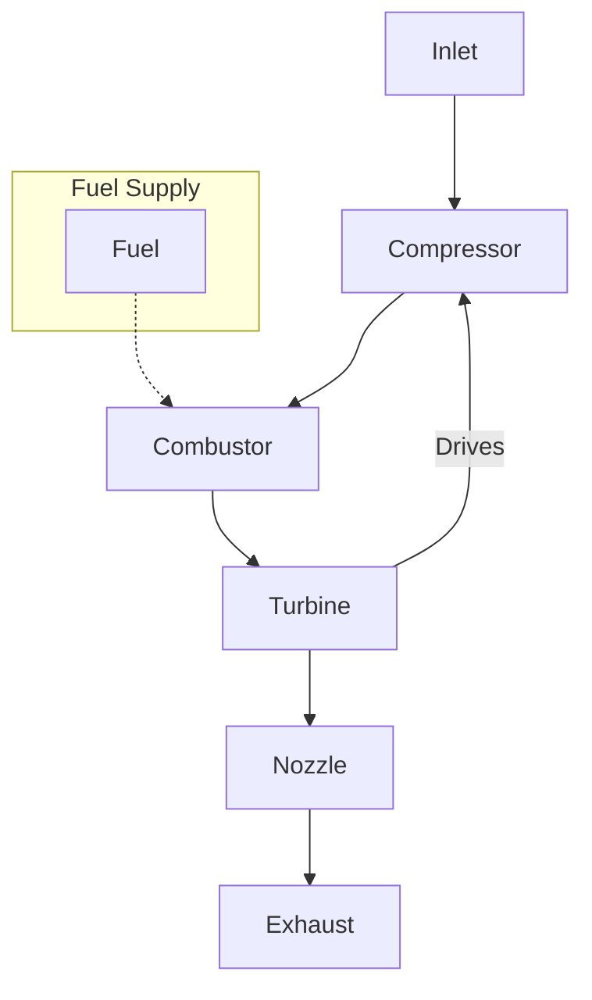

# EAS4300 – HW7 Q2: Turbojet with Afterburner Analysis

This repository contains the MATLAB code and outputs for extending the turbojet performance analysis from [HW7_Q1.m](../HW7_Q1/HW7_Q1.m) by adding an afterburner stage. In this problem, an afterburner is incorporated with a maximum stagnation temperature of $T_{06,ab} = 2000$ K, an afterburner combustion efficiency of $\eta_{ab} = 0.95$, and a pressure ratio of $r_{ab} = 0.97$. All other efficiencies remain unchanged from the base model.

The script computes key performance parameters for both non-afterburner and afterburner cases, including:
- **Specific Thrust** ($I$)
- **Thrust-Specific Fuel Consumption** (TSFC)
- **Thermal Efficiency** ($\eta_{th}$)
- **Propulsive Efficiency** ($\eta_{p}$)
- **Overall Efficiency** ($\eta_{0}$)
- **Nozzle Area Ratio**

These are plotted as functions of the compressor pressure ratio $r_c$.

---

## Files

1. [**HW7_Q2.m**](HW7_Q2.m)  
   MATLAB script for the turbojet analysis with an afterburner. This script calculates the performance parameters, generates the plots, and writes data to a CSV file.

2. [**HW7_Q2_Data.csv**](HW7_Q2_Data.csv)  
   CSV file containing the computed performance data for both non-afterburner and afterburner configurations.

3. [**HW7_Q2_Plots.pdf**](HW7_Q2_Plots.pdf)  
   A multi-page PDF file containing the following plots:
   - **Page 1:** Specific Thrust vs. $r_c$
   - **Page 2:** TSFC vs. $r_c$
   - **Page 3:** Efficiencies ($\eta_{th}$, $\eta_{p}$, $\eta_{0}$) vs. $r_c$
   - **Page 4:** Nozzle Area Ratio vs. $r_c$

4. [**HW7_Q1.m**](../HW7_Q1/HW7_Q1.m)
   The MATLAB script for the base turbojet analysis without an afterburner. This file is referenced here as the starting point for HW7_Q2.

---

## Usage

1. Open [**HW7_Q2.m**](HW7_Q2.m) in MATLAB (R2020a or newer is recommended for the multi-page PDF export).
2. Run the script to generate:
   - [**HW7_Q2_Data.csv**](HW7_Q2_Data.csv) with the computed performance data.
   - [**HW7_Q2_Plots.pdf**](HW7_Q2_Plots.pdf) containing the plots for both non-afterburner and afterburner cases.

---

## Notes

- The analysis ensures that the overall fuel-to-air ratio satisfies $f_b + f_{ab} \le f_{st}$.
- The afterburner stage adds additional fuel to raise the stagnation temperature after the turbine, modifying the performance curves relative to the base case in [HW7_Q1.m](../HW7_Q1/HW7_Q1.m).
- If you are using an older version of MATLAB (pre-R2020a), you may need alternative methods to combine multiple figures into a single PDF.

---

## Turbojet Diagram

Below is a simple 2D turbojet diagram using Mermaid syntax:

This diagram shows the basic flow in a turbojet engine where the turbine drives the compressor and fuel is injected in the combustor.