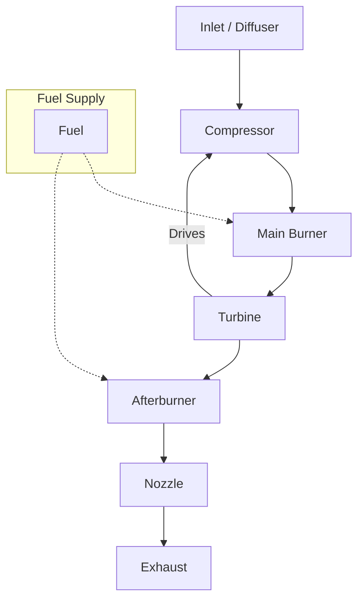

# EAS4300 – HW7 Q2: Turbojet with Afterburner Analysis

This folder extends the turbojet analysis from [HW7_Q1.m](../HW7_Q1/HW7_Q1.m) by adding an afterburner with a maximum stagnation temperature of $T_{06,ab} = 2000$ K, a combustion efficiency of $\eta_{ab} = 0.95$, and a total pressure ratio of $r_{ab} = 0.97$. All other conditions and efficiencies are the same as Q1.

The script computes, for both the non-afterburning and afterburning engine:
- **Specific Thrust** ($I$)
- **Thrust-Specific Fuel Consumption** (TSFC)
- **Thermal Efficiency** ($\eta_{th}$)
- **Propulsive Efficiency** ($\eta_{p}$)
- **Overall Efficiency** ($\eta_{0}$)
- **Nozzle Area Ratio**

as functions of the compressor pressure ratio $r_c$ from 2 to 60, with the exhaust ideally expanded.

---

## Effect of the Afterburner (compared with Q1)

| | Without afterburner | With afterburner |
|---|---|---|
| Specific thrust | 657 m/s at $r_c = 2$, peak **708 m/s at $r_c \approx 6.1$**, 421 m/s at $r_c = 60$ | 890 m/s at $r_c = 2$, peak **1106 m/s at $r_c \approx 21$**, 1026 m/s at $r_c = 60$ |
| TSFC | minimum **3.59e-5 s/m at $r_c \approx 43$** | minimum **4.93e-5 s/m at $r_c \approx 21$** |
| $\eta_{th}$ (max) | 0.51 | 0.48 |
| $\eta_p$ (range) | 0.62–0.73 | 0.52–0.58 |
| $\eta_0$ (max) | 0.34 | 0.25 |
| Nozzle area ratio | 1.74–3.02 | 1.71–2.97 |
| Total fuel-to-air ratio | 0.015–0.035 | 0.054–0.055 |

- **Thrust:** The afterburner reheats the turbine exhaust to 2000 K, so the exhaust leaves much faster. Specific thrust rises by a factor of 1.4 at $r_c = 2$, 1.7 at $r_c = 20$, and 2.4 at $r_c = 60$. The thrust peak also moves from $r_c \approx 6$ to $r_c \approx 21$: with the afterburner restoring the gas temperature, the higher nozzle pressure from a larger $r_c$ keeps paying off for longer.
- **TSFC:** Fuel consumption per unit thrust is 14–46% higher with the afterburner. The extra fuel is burned at the low pressure after the turbine, where it converts to kinetic energy less efficiently than fuel burned in the main combustor.
- **Efficiencies:** $\eta_{th}$ drops slightly for the same reason. $\eta_p$ drops more, because the faster exhaust leaves more kinetic energy behind in the wake. Together they lower $\eta_0$ from at most 0.34 to at most 0.25.
- **Nozzle area ratio:** Nearly unchanged, slightly lower, because the afterburner's 3% pressure loss lowers the nozzle pressure ratio a little. The hotter gas needs a larger nozzle throat, but the exit-to-throat ratio depends only on the exit Mach number.
- **Stoichiometric limit:** The afterburner adds about 0.019–0.039 to the main-burner fuel, so the total $f_b + f_{ab}$ is 0.054–0.055, below $f_{st} = 0.06$ across the whole range. The script enforces $f_b + f_{ab} \le f_{st}$: if the total would exceed it, the afterburner burns only $f_{st} - f_b$ and $T_{06}$ is solved for from the energy balance.

---

## Method Notes

- **Main burner:** $C_{p,air} T_{03} + f_b\,\eta_b\,\Delta h_c = (1+f_b)\,C_{p,gas}\,T_{04}$, with $C_{p,air}$ from $\gamma = 1.4$ and $C_{p,gas}$ from $\gamma = 1.3$.
- **Afterburner:** $(1+f_b)\,C_{p,gas}\,T_{05} + f_{ab}\,\eta_{ab}\,\Delta h_c = (1+f_b+f_{ab})\,C_{p,gas}\,T_{06}$.
- Both engines are computed in the same loop, so the non-afterburner curves match Q1.

---

## Files

1. [**HW7_Q2.m**](HW7_Q2.m)  
   MATLAB script for the turbojet with and without the afterburner, organized into sections for MATLAB `publish`.

2. [**HW7_Q2_Data.csv**](HW7_Q2_Data.csv)  
   One row per $r_c$ with the fuel-to-air ratios ($f_b$, $f_{ab}$, total), the afterburner exit temperature $T_{06}$, and $I$, TSFC, $\eta_{th}$, $\eta_p$, $\eta_0$, and area ratio for both engines.

3. [**HW7_Q2.pdf**](HW7_Q2.pdf)  
   Published report with the code, the optimum-$r_c$ output, and all four comparison figures:
   - Figure 1: Specific Thrust vs. $r_c$
   - Figure 2: TSFC vs. $r_c$
   - Figure 3: Efficiencies ($\eta_{th}$, $\eta_{p}$, $\eta_{0}$) vs. $r_c$
   - Figure 4: Nozzle Area Ratio vs. $r_c$

---

## Usage

From this folder in MATLAB, run:

```matlab
publish('HW7_Q2.m', 'format', 'pdf', 'outputDir', pwd);
```

This runs the analysis, writes `HW7_Q2_Data.csv`, and creates `HW7_Q2.pdf`.

---

## Turbojet Diagram


```mermaid
flowchart TD
    A[Inlet / Diffuser] --> B[Compressor]
    B --> C[Main Burner]
    C --> D[Turbine]
    D --> E[Afterburner]
    E --> F[Nozzle]
    F --> G[Exhaust]
    D -- Drives --> B
    subgraph Fuel Supply
        H[Fuel]
    end
    H -.-> C
    H -.-> E
```

The turbine drives the compressor. Fuel is injected in the main burner and again in the afterburner, which reheats the turbine exhaust before the nozzle.
