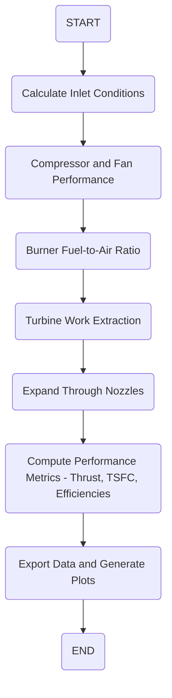

# HW8_Q1 - Turbofan Engine Performance Analysis

This repository contains a MATLAB project for EAS 4300 Homework #8, Question 1. The project performs performance analysis of a turbofan engine for a commercial aircraft cruising at a Mach number of 0.8. Key performance parameters such as specific thrust, TSFC, thermal efficiency, propulsive efficiency, overall efficiency, and exit Mach numbers (for both core and bypass streams) are computed as a function of bypass ratio.

## Files

- **HW8_Q1.m**  
  The main MATLAB script that:
  - Sets up the engine cycle calculations.
  - Computes performance metrics over a specified range of bypass ratios.
  - Exports the computed data to a CSV file.
  - Generates four separate plots (saved as separate pages in a multi-page PDF).

- **HW8_Q1_data.csv**  
  CSV file containing the computed data from the MATLAB script.

- **HW8_Q1_plots.pdf**  
  Multi-page PDF containing the following plots (each on a separate page):
  - Specific Thrust vs. Bypass Ratio
  - TSFC vs. Bypass Ratio
  - Efficiencies (thermal, propulsive, overall) vs. Bypass Ratio
  - Mach Numbers (core and bypass) vs. Bypass Ratio

- **README.md**  
  This file, which explains the project details and how to run the code.

## Requirements

- MATLAB (R2020a or later is recommended for `exportgraphics` functionality)
- Basic familiarity with MATLAB and thermodynamic cycle analysis

## How to Run

1. **Clone or Download the Repository**  
   Ensure all files are in your working directory.

2. **Run the MATLAB Script**  
   Open MATLAB and navigate to the repository directory. Run the script:
   ```matlab
   HW8_Q1
The script will:
- Compute the engine performance over the range of bypass ratios.
- Save the performance data into `HW8_Q1_data.csv`.
- Create four individual figures and save them into a single multi-page PDF (`HW8_Q1_plots.pdf`).

3. **Review the Output**  
   Open `HW8_Q1_data.csv` to view the numerical results, and view `HW8_Q1_plots.pdf` to inspect the generated plots.

## Description

The MATLAB code in this project includes:
- **Engine Cycle Calculations:**  
  Implements thermodynamic calculations for a turbofan engine, including inlet conditions, compressor and fan performance, burner fuel-to-air ratio (constrained by stoichiometric limits), turbine work extraction, and nozzle expansion.

- **Performance Metrics:**  
  Computes:
  - **Specific Thrust** (m/s)
  - **Thrust Specific Fuel Consumption (TSFC)**
  - **Thermal Efficiency (η<sub>th</sub>)**
  - **Propulsive Efficiency (η<sub>p</sub>)**
  - **Overall Efficiency (η<sub>o</sub>)**
  - **Core and Bypass Exit Mach Numbers**

- **Data Export and Plotting:**  
  Exports the results to a CSV file and generates four separate plots (each scaled to 6×4 inches) that are saved into a single multi-page PDF file.

### Flowchart


### Key Equations

**Inlet Total Temperature:**

$$
T_{0a} = T_a \left( 1 + \frac{k-1}{2} M_f^2 \right)
$$

**Fuel-to-Air Ratio (with Stoichiometric Limit):**

$$
F_b = \min\left( \frac{T_{04_{\text{max}}} - T_3}{\left(\frac{\eta_b \, dhc}{C_{p2}}\right) - T_{04_{\text{max}}}}, \, f_{stoic} \right)
$$

**Specific Thrust:**

$$
I = (1 + F_b) \, U_{e,\text{hot}} - U + \beta \left( U_{e,\text{cold}} - U \right)
$$

**Thrust Specific Fuel Consumption (TSFC):**

$$
TSFC = \frac{F_b}{I}
$$

**Thermal Efficiency:**

$$
\eta_{th} = \frac{(1 + F_b) \, U_{e,\text{hot}}^2 + \beta \, U_{e,\text{cold}}^2 - (\beta + 1) \, U^2}{2 \, F_b \, dhc \times 1000}
$$

**Propulsive Efficiency:**

$$
\eta_p = \frac{2\left[\beta \left(U_{e,\text{cold}} - U\right) + \left((1+F_b) \, U_{e,\text{hot}} - U\right)\right]U}{(1+F_b) \, U_{e,\text{hot}}^2 + \beta \, U_{e,\text{cold}}^2 - (\beta+1) \, U^2}
$$

**Overall Efficiency:**

$$
\eta_0 = \eta_{th} \times \eta_p
$$

**Nozzle Exit Mach Number (General Form):**

$$
M = \sqrt{\frac{2\left(\frac{T_0}{T} - 1\right)}{k-1}}
$$

## Customization

You can adjust the following parameters in the script:
- **Ambient Conditions:** Ambient temperature (`Ta`), ambient pressure (`Pa`).
- **Engine Parameters:** Maximum turbine inlet temperature (`T04_max`), pressure ratios (`rc`, `rf`, etc.), and efficiency values.
- **Bypass Ratio Range:** Modify the `beta` range to analyze different engine configurations.

## Acknowledgments

- Original code was created by Stephen Miller on 4/13/22.
- This project was developed for educational purposes in the EAS 4300 course.
